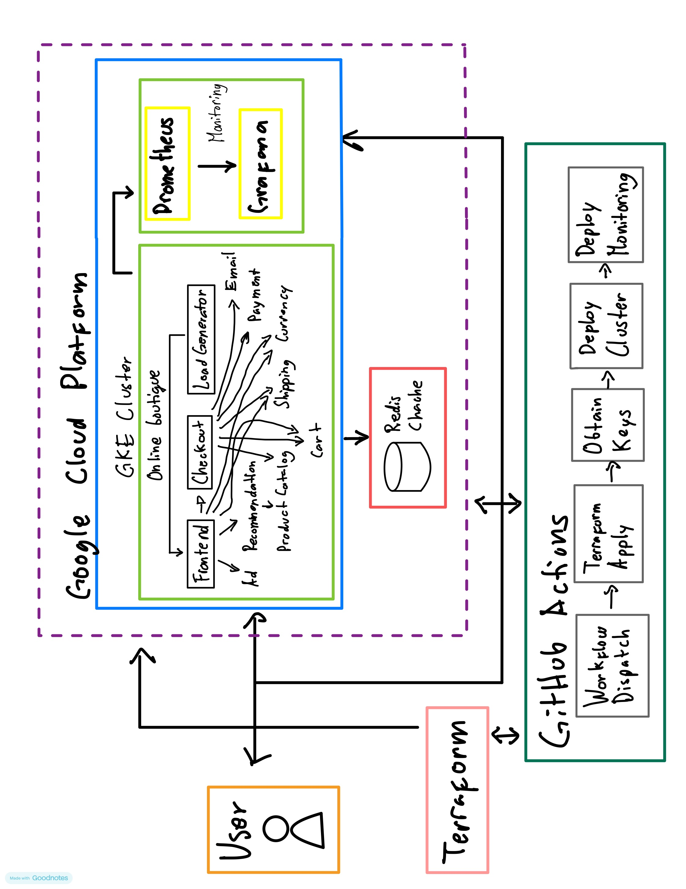
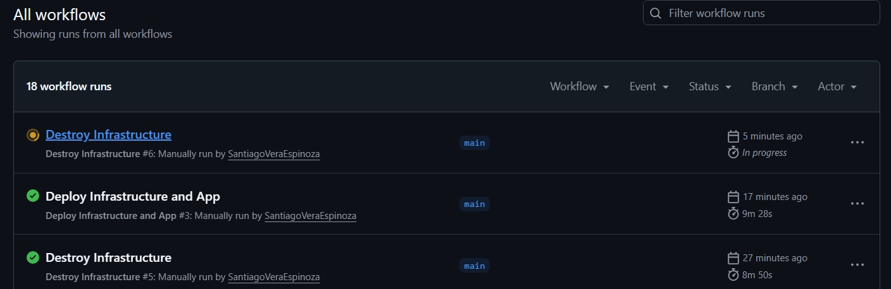
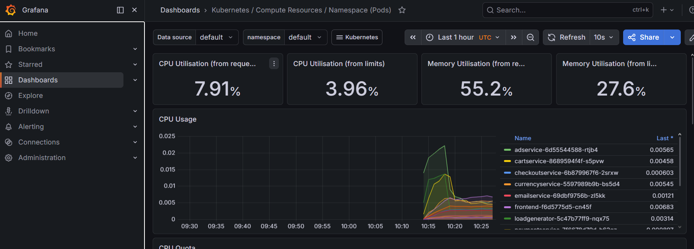

# DevOps + AI Use Case

## Overview
Deploying and monitoring a cloud-native microservices application manually is slow, error-prone, and hard to reproduce. Every time you need a fresh environment you'd have to provision infrastructure, deploy apps, and set up monitoring by hand.

1. One-button deployment: A single GitHub Actions workflow trigger provisions the infrastructure with Terraform, deploys the app to GKE, and sets up monitoring — no manual steps.

2. One-button teardown: The same pipeline can destroy everything cleanly, avoiding unnecessary GCP costs when the environment isn't needed.

3. Basic metric monitoring: Prometheus collects metrics from the cluster and pods, Grafana visualizes them — CPU and memory per pod out of the box, so you can see what's happening without digging into logs.

## Architecture


## Tech Stack
- Terraform
- Kubernetes
- Prometheus
- Grafana
- GitHub Actions

## Deployment Steps
1. Set the Google Cloud project and region and ensure the Google Kubernetes Engine API is enabled.

   ```sh
   export PROJECT_ID=<PROJECT_ID>
   export ZONE=us-central1-a
   gcloud services enable container.googleapis.com \
     --project=${PROJECT_ID}
   ```

2. Apply Terraform
   ```sh
   cd ./terraform
   terraform apply
   ```

3. Get cloud credentials
   ```sh
   gcloud container clusters get-credentials online-boutique --zone $ZONE --project $PROJECT_ID
   ```

4. Deploy Online Boutique to the cluster.

   ```sh
   kubectl apply -f ../release/kubernetes-manifests.yaml
   ```

5. Wait for the pods to be ready.

   ```sh
   kubectl get pods
   ```

   After a few minutes, you should see the Pods in a `Running` state:

   ```
   NAME                                     READY   STATUS    RESTARTS   AGE
   adservice-76bdd69666-ckc5j               1/1     Running   0          2m58s
   cartservice-66d497c6b7-dp5jr             1/1     Running   0          2m59s
   checkoutservice-666c784bd6-4jd22         1/1     Running   0          3m1s
   currencyservice-5d5d496984-4jmd7         1/1     Running   0          2m59s
   emailservice-667457d9d6-75jcq            1/1     Running   0          3m2s
   frontend-6b8d69b9fb-wjqdg                1/1     Running   0          3m1s
   loadgenerator-665b5cd444-gwqdq           1/1     Running   0          3m
   paymentservice-68596d6dd6-bf6bv          1/1     Running   0          3m
   productcatalogservice-557d474574-888kr   1/1     Running   0          3m
   recommendationservice-69c56b74d4-7z8r5   1/1     Running   0          3m1s
   redis-cart-5f59546cdd-5jnqf              1/1     Running   0          2m58s
   shippingservice-6ccc89f8fd-v686r         1/1     Running   0          2m58s
   ```

6. Deploy the monitoring stack (Prometheus + Grafana).

   Create the monitoring namespace:

   ```sh
   kubectl create namespace monitoring
   ```

7. Add the Prometheus Helm repository.
   ```sh
   helm repo add prometheus-community https://prometheus-community.github.io/helm-charts
   helm repo update
   ```

8. Deploy kube-prometheus-stack.
   ```sh
   helm upgrade --install monitoring \
   prometheus-community/kube-prometheus-stack \
   --namespace monitoring \
   -f release/monitoring/values.yaml
   ```

9. Access the web frontend in a browser using the frontend's external IP.

   ```sh
   kubectl get service frontend-external | awk '{print $4}'
   ```

   Visit `http://EXTERNAL_IP` in a web browser to access your instance of Online Boutique.

10. Access Grafana using the Grafana external IP.

   ```sh
   kubectl get service monitoring-grafana -n monitoring | awk '{print $4}'
   ```

   Visit `http://EXTERNAL_IP` in a web browser to access Grafana.

   Default credentials:
   ```sh
   Username: admin
   Password: admin123
   ```

11. Once you are done with it, delete the GKE cluster.

   ```sh
   terraform destroy
   ```

Deleting the cluster may take a few minutes.

## Monitoring
The system collects Kubernetes workload and infrastructure metrics through Prometheus and visualizes them in Grafana dashboards.

### Container / Pod Metrics

#### CPU usage per pod
- Tracks CPU consumption using container runtime metrics.
- Used to identify CPU-heavy workloads and potential bottlenecks.

#### Memory usage per pod
- Measures working set memory per container.
- Helps detect memory leaks and overall resource pressure.

## Automation
The system uses a GitHub Actions pipeline to provision infrastructure, deploy the application, and expose observability components on a Kubernetes cluster.

### Deployment

#### Infrastructure Provisioning (Terraform)

The pipeline starts by initializing and managing infrastructure using Terraform.

- `terraform init`: Initializes backend and providers
- `terraform destroy`: Cleans up any existing infrastructure (ensures idempotency for fresh deployments)
- `terraform apply`: Provisions:
   - GKE cluster
   - Node pools (configurable machine type)
   - Required IAM and networking resources

This ensures the environment is always reproducible from code.

#### Authentication to GCP

The pipeline authenticates securely using Workload Identity Federation:

- No static service account keys
- GitHub Actions exchanges identity token for GCP access
- Grants access to:
   - GKE cluster management
   - Kubernetes API interaction

#### Kubernetes Access Setup

After infrastructure is ready:
   - `gcloud container clusters get-credentials`
   - Configures `kubectl` context
   - Enables direct deployment into the cluster

#### Application Deployment

The application is deployed using Kubernetes manifests:
   - `kubectl apply -f kubernetes-manifests.yaml`

#### Observability Stack Deployment

Grafana and Prometheus-based monitoring are deployed alongside the application.

### Environment Destroy

It’s the step that tears down the entire environment created by the pipeline.
- Deletes the Kubernetes cluster (GKE)
- Removes nodes and node pools
- Deletes load balancers / external IPs
- Removes associated cloud networking resources
- Cleans up everything created during deployment

It also helps replacing exiting infrastructure.

## AI Agent Design
Link to AI agent SDD.

## Evidence

### Screenshots
- First run: 
- Got pipelines working: 
- Put Grafana to work: 

### Progress Logs
- [Progress log](docs/progress_log.md).

### Architecture Design Records
- [Why GCP?](docs/adr/001_use_gcp.md).
- [Why Terraform?](docs/adr/002_use_terraform.md).
- [Why Prometheus and Grafana?](docs/adr/003_use_prometheus_grafana.md).

## Tradeoffs
To meet time constraints and keep the system simple and reproducible, several aspects of a production-grade setup were intentionally simplified:

### Managed Kubernetes (GKE) over multi-cluster or hybrid setups
A single GKE cluster was used to reduce operational complexity and focus on application + observability rather than infrastructure scaling. Additionally, the cluster is deployed in a single zone to minimize cost exposure and stay within free-tier / low-cost usage constraints, avoiding the added expense and complexity of multi-zone or multi-region high availability setups.

### Prebuilt dashboards instead of fully custom Grafana designs
Existing Kubernetes dashboards were reused to accelerate delivery and avoid spending time on UI/visual tuning.

### No long-term metric storage or high availability tuning
Prometheus runs in a standard configuration without remote storage, replication, or high-availability optimizations.

### Minimal CI/CD logic
The pipeline focuses on provisioning, deployment, and teardown, without advanced promotion stages or multi-environment workflows.