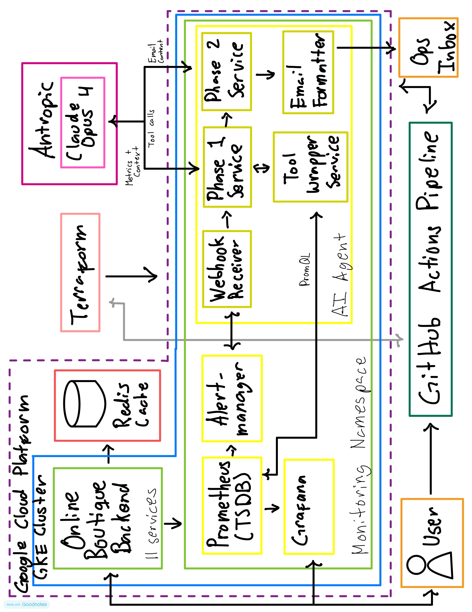

# AI Agent Architecture Document

## Overview

### Purpose

This document describes the architecture of an AI-powered operational agent designed to assist the SRE/DevOps team in analyzing performance anomalies across the Online Boutique deployment on GKE. The agent activates automatically when Alertmanager fires an alert (CPU spike, memory pressure, high error rate), queries Prometheus for relevant metrics, and produces a natural-language correlation report delivered by email to the operations team.

The goal is not to replace human judgment, but to reduce mean time to understand (MTTU): instead of an on-call engineer opening Grafana at 2 AM and manually correlating graphs, they receive a structured first-pass analysis in their inbox within seconds of the alert firing.

### Primary Use Cases

| Use Case | Trigger | Output |
|----------|----------|----------|
| CPU spike analysis | CPU utilization alert > threshold | Root-cause hypothesis: which service consumed CPU and whether it correlates with increased traffic or a neighbor service
| Memory pressure analysis | Memory usage alert > threshold | Identifies which pods are growing, checks for OOM Kill events, correlates with recent deployments

## Proposed Technology Stack

- **Programming Language:** Python 3.12 — chosen for its first-class Anthropic SDK support, rapid iteration speed. The rich data-handling libraries make parsing Prometheus time-series responses and validating Alertmanager payloads straightforward.
- **LLM Provider:** Anthropic — `claude-opus-4` model. Selected for its superior multi-step reasoning capability, which is required for the two-phase tool-calling pattern (Phase 1: decide what metrics to fetch; Phase 2: analyze and correlate). The model's large context window (200k tokens) allows including multiple metric time series without truncation.
- **Frameworks & Libraries:**
  - `FastAPI` — async HTTP server for the webhook receiver endpoint; handles Alertmanager's 10s timeout cleanly via `BackgroundTasks`
  - `anthropic` (official Python SDK) — Anthropic API client with native tool calling support
  - `httpx` — async HTTP client for Prometheus API queries
  - `pydantic` v2 — request/response validation for Alertmanager payloads and tool call inputs
  - `aiosmtplib` — async SMTP for email delivery without blocking the event loop
  - `kubernetes` (official Python client) — optional enrichment with pod/deployment metadata from the K8s API
- **Data Storage:** None (stateless by design). Each alert analysis is independent. If report history is needed in the future, a lightweight append-only log to a GCS bucket suffices — no database required.
- **Messaging / Eventing:** Alertmanager webhook (HTTP POST). No message queue is needed at this scale. If alert volume grows beyond ~10 concurrent alerts, a Redis-backed queue (`arq` or Celery) can be added in front of the analysis worker pool.

## System Architecture

### High-Level Components

#### User Interface Layer

There is no interactive UI in the initial implementation — this is intentional. The email inbox is the interface. Ops engineers already monitor their email during on-call; adding another dashboard would increase cognitive load rather than reduce it.

The email is structured as a human-readable report with three sections: (1) alert context, (2) raw metric summary (tables of values Claude requested), and (3) the AI-generated correlation analysis. No login, no new tool to learn.

A future CLI or Slack bot can be layered on top of the same HTTP API without changing the core agent logic.

#### API / Orchestration Layer

The agent is a single Kubernetes `Deployment` running in the `monitoring` namespace. It exposes one primary endpoint:
 
- `POST /alert` — receives the Alertmanager webhook payload, orchestrates the two-phase Claude interaction, queries Prometheus, and triggers email delivery.
A secondary endpoint for health checking:
 
- `GET /healthz` — returns HTTP 200, used by the K8s liveness/readiness probe.

The orchestration layer is responsible for:
1. Parsing the Alertmanager payload and extracting alert name, labels, and firing timestamp.
2. Calling Claude (Phase 1) with the alert context and available tool definitions.
3. Executing the PromQL queries that Claude requests via tool calls.
4. Calling Claude (Phase 2) with the metric results to generate the final analysis.
5. Formatting and sending the email report.

### Architecture Diagram



**Component legend:**
> - **Light Green — GKE namespaces (App and Monitoring):** Online Boutique Backend, Prometheus, Alertmanager, Grafana, kube-prometheus-stack and the agent deployment itself.
> - **Blue — Google Kubernetes Engine Cluster:** Where the pods are allocated.
> - **Dotted Purple — Google Cloud Platform:** Cloud provider.
> - **Pink — AI API:** Claude API calls (Phase 1 tool calling, Phase 2 analysis).
> - **Ivory — Terraform:** Arquitecture level representation of the Terraform intervention.
> - **Red — Cache:** Cache saving for cart items (Online Boutique).
> - **Dark Green — GitHub Pipeline:** The pipeline that deploys and destroys the infrastructure.
> - **Orange — Client-side items:** User interacting or the operations team.

## Data Flow

The following sequence describes what happens from alert firing to email delivery:
 
```
1. Prometheus evaluates a PrometheusRule every 30s.
   If the condition holds for `for: 5m`, it marks the alert as FIRING.
 
2. Alertmanager receives the FIRING alert and routes it to the
   webhook receiver based on the route config in values.yaml.
 
3. POST /alert is called with the Alertmanager payload:
   {
     "alerts": [{
       "labels": { "alertname": "HighCPU", "service": "cartservice", "severity": "warning" },
       "annotations": { "summary": "CPU > 80% on cartservice" },
       "startsAt": "2025-05-15T02:00:00Z"
     }]
   }
 
4. The agent responds HTTP 200 immediately (Alertmanager has a 10s timeout).
   Analysis continues asynchronously in a background task.
 
5. PHASE 1 — Claude is called with:
   - The alert context (service, metric, timestamp, severity)
   - Tool definitions: get_metric_range, get_top_cpu_consumers,
     get_service_error_rate, get_pod_restarts
   Claude responds with one or more tool_use blocks specifying
   exactly which queries to run and over which time window.
 
6. The agent executes the PromQL queries against Prometheus HTTP API:
   GET http://kube-prometheus-stack-prometheus.monitoring.svc:9090
       /api/v1/query_range
       ?query=rate(container_cpu_usage_seconds_total{pod=~"cartservice.*"}[5m])
       &start=2025-05-15T01:30:00Z
       &end=2025-05-15T02:05:00Z
       &step=30s
 
7. PHASE 2 — Claude is called again with the full conversation history
   plus tool_result blocks containing the metric data.
   Claude generates the correlation analysis in plain text.
 
8. The agent formats the email (HTML or plain text) and sends it via SMTP.
 
9. Ops team receives the email within ~15–30 seconds of alert firing.
```

## Integration with Existing Infrastructure

#### Kubernetes / GKE Integration

The agent deploys as a standard Kubernetes `Deployment` with the following characteristics:
 
- **Namespace:** `monitoring` — co-located with the rest of the observability stack, simplifying network policies.
- **Service:** `ClusterIP` only — not exposed outside the cluster. Alertmanager calls it via its in-cluster DNS name: `http://ai-ops-agent.monitoring.svc.cluster.local:8080/alert`.
- **ServiceAccount:** A dedicated ServiceAccount with a minimal ClusterRole — `get` and `list` on `pods` and `deployments` in the `default` namespace only. This allows the agent to enrich reports with pod restart counts or replica status without needing cluster-admin permissions.
- **Secret:** The Anthropic API key and SMTP credentials are stored in a Kubernetes `Secret` named `ai-ops-agent-secrets`, mounted as environment variables. The Secret is created once manually (or via Terraform) and never committed to Git.

#### Monitoring Stack Integration

The agent integrates with the existing `kube-prometheus-stack` at two points, both read-only:
 
1. **Alertmanager (event source):** Alertmanager pushes alert events to the agent via the webhook receiver. The agent never writes back to Alertmanager — it only consumes events.
2. **Prometheus HTTP API (data source):** The agent queries Prometheus using its internal HTTP API. All queries are `GET` requests — the agent has no write access to Prometheus. The agent uses `query_range` (time-series data) and `query` (instant queries) endpoints.
No changes are required to the existing Prometheus configuration, ServiceMonitors, or Grafana dashboards.

## Metrics Access & Processing
 
- **Data Sources:**
  - Prometheus TSDB via HTTP API (`/api/v1/query_range`, `/api/v1/query`)
  - Kubernetes API (optional enrichment — pod restarts, replica counts, recent events)

- **Processing Strategy:**
  The agent does not pull all available metrics. Instead, it uses a **demand-driven fetching pattern** governed by the LLM in Phase 1. Claude receives the alert context and a catalog of available tool functions. It decides which metrics are relevant to the specific alert and requests only those. This avoids flooding the LLM context with irrelevant series and keeps token cost predictable.

  The available tool catalog includes:
  | Tool | PromQL (example) | Purpose |
  |---|---|---|
  | `get_metric_range` | Any query, configurable window | General-purpose metric fetch |
  | `get_top_cpu_consumers` | `topk(5, rate(container_cpu_usage_seconds_total[5m]))` | Find which pods are consuming CPU |
  | `get_top_memory_consumers` | `topk(5, container_memory_working_set_bytes)` | Find which pods are consuming memory |
  | `get_service_error_rate` | `rate(http_requests_total{status_code=~"5.."}[5m])` by service | Error rate per service |
  | `get_service_latency_p99` | `histogram_quantile(0.99, rate(http_request_duration_seconds_bucket[5m]))` | P99 latency per service |
  | `get_pod_restarts` | `increase(kube_pod_container_status_restarts_total[30m])` | Recent pod restarts |
  | `get_request_rate` | `sum(rate(http_requests_total[5m])) by (service)` | Traffic volume per service | 
  
  Metric time series are returned as JSON arrays and passed directly to Claude in Phase 2. No transformation or aggregation is performed by the agent — Claude receives the raw series and performs interpretation.

## User Interface

###  Interface Type

**Email (HTML)** is the primary and only interface in v1. This decision is deliberate:
 
- Ops engineers already have email open during on-call rotations.
- Email is asynchronous and persistent — the report is available even if the engineer is not at their desk when the alert fires.
- No authentication, no new tool to learn, no additional dashboard to maintain.
- Email clients render HTML tables and pre-formatted text, making metric summaries readable without a dedicated UI.
A Slack integration is a natural v2 addition — the same report can be posted to a `#alerts` channel by adding a Slack webhook call alongside the email send. No changes to the agent core logic.

### Interaction Flow

The current interaction is **one-way and event-driven**: the alert fires → the agent analyzes → the engineer receives the report. There is no back-and-forth in v1.
 
The email report has the following structure:
 
```
Subject: [WARNING] HighCPU on cartservice — AI Analysis
 
━━━━━━━━━━━━━━━━━━━━━━━━━━━━━━━━━━━━━━
ALERT CONTEXT
━━━━━━━━━━━━━━━━━━━━━━━━━━━━━━━━━━━━━━
Alert:    HighCPU
Service:  cartservice
Severity: warning
Fired at: 2025-05-15 02:00:00 UTC
Window:   2025-05-15 01:30 → 02:05 UTC
 
━━━━━━━━━━━━━━━━━━━━━━━━━━━━━━━━━━━━━━
METRICS ANALYZED
━━━━━━━━━━━━━━━━━━━━━━━━━━━━━━━━━━━━━━
• cartservice CPU usage (last 35 min): peak 92% at 01:58 UTC
• Top CPU consumers: cartservice (92%), frontend (34%), redis (12%)
• cartservice request rate: 2.1x spike starting 01:52 UTC
• checkoutservice error rate: rose from 0.1% to 4.2% at 01:54 UTC
• cartservice pod restarts in last 30 min: 0
 
━━━━━━━━━━━━━━━━━━━━━━━━━━━━━━━━━━━━━━
AI CORRELATION ANALYSIS
━━━━━━━━━━━━━━━━━━━━━━━━━━━━━━━━━━━━━━
The CPU spike on cartservice (01:52 UTC) is temporally correlated
with a 2.1x increase in incoming request rate, suggesting a traffic
surge rather than a code regression or memory leak.
 
The subsequent rise in checkoutservice error rate (01:54 UTC, +2 min
lag) is consistent with cartservice becoming a bottleneck — checkout
calls depend on cart operations, and increased latency from cartservice
would cascade as timeouts in checkoutservice.
 
No pod restarts were observed, ruling out OOMKill as a contributing
factor. The pattern is consistent with an underprovisionend cartservice
under load spikes.
 
RECOMMENDED ACTIONS:
1. Check if HPA is configured for cartservice and whether it scaled.
2. If no HPA, consider manually scaling: kubectl scale deployment
   cartservice --replicas=3
3. Investigate the source of the traffic surge (external load test?
   marketing campaign? bot traffic?).
 
This analysis is based on metrics only. Human review is required.
━━━━━━━━━━━━━━━━━━━━━━━━━━━━━━━━━━━━━━
```

### Example Commands

The following examples show the tool calls Claude issues in Phase 1, and the corresponding PromQL queries the agent executes:
 
**Claude Phase 1 tool call:**
```json
{
  "type": "tool_use",
  "name": "get_top_cpu_consumers",
  "input": {
    "namespace": "default",
    "window": "5m",
    "start": "2025-05-15T01:30:00Z",
    "end": "2025-05-15T02:05:00Z"
  }
}
```
 
**Agent executes:**
```
GET /api/v1/query_range
  ?query=topk(5, sum(rate(container_cpu_usage_seconds_total{namespace="default"}[5m])) by (pod))
  &start=2025-05-15T01:30:00Z
  &end=2025-05-15T02:05:00Z
  &step=30s
```
 
**Claude Phase 1 tool call:**
```json
{
  "type": "tool_use",
  "name": "get_service_error_rate",
  "input": {
    "service": "checkoutservice",
    "window": "5m",
    "start": "2025-05-15T01:30:00Z",
    "end": "2025-05-15T02:05:00Z"
  }
}
```

**Agent executes:**
```
GET /api/v1/query_range
  ?query=sum(rate(http_requests_total{service="checkoutservice",status_code=~"5.."}[5m]))
         / sum(rate(http_requests_total{service="checkoutservice"}[5m]))
  &start=2025-05-15T01:30:00Z
  &end=2025-05-15T02:05:00Z
  &step=30s
```

## Security Considerations

| Concern | Mitigation |
|---|---|
| **API key exposure** | Anthropic API key stored in a Kubernetes `Secret`. Mounted as env var. Never in code, ConfigMaps, or logs. |
| **Network exposure** | Agent Service is `ClusterIP` — not reachable from outside the cluster. Alertmanager calls it via in-cluster DNS. |
| **Least privilege** | Agent ServiceAccount has only `get`/`list` on `pods` and `deployments` in `default` namespace. No cluster-wide permissions. |
| **Metric data sensitivity** | Prometheus metric data sent to Claude API contains only numerical time series and Kubernetes label values (pod names, namespaces). No PII, no application payload data. |
| **Prompt injection** | Alert labels and annotations from Alertmanager are passed as structured data (JSON fields), not interpolated into the system prompt as free text. This prevents a malicious label value from hijacking the prompt. |
| **Email delivery** | SMTP credentials stored in the same `ai-ops-agent-secrets` Secret. TLS enforced on SMTP connection. |
| **Audit trail** | All Claude API calls are logged (alert name, timestamp, tools requested, tokens used) to stdout, captured by GKE's Cloud Logging. |

## Scalability & Performance

**Stateless design:** Each alert analysis is independent. No shared state between requests. The agent can scale horizontally by increasing `replicas` in the Deployment.
 
**Async processing:** The `/alert` endpoint returns HTTP 200 immediately after validating the payload. The two-phase Claude interaction and email send run in a background async task (Python). This prevents Alertmanager from timing out (10s default) on slow LLM responses.
 
**Expected latency per alert:**
- Phase 1 Claude call: ~2–4s
- PromQL queries (3–5 queries): ~200ms total
- Phase 2 Claude call: ~3–6s
- Email send: ~500ms
- **Total: ~6–11 seconds** from alert receipt to email sent.
**Alert deduplication:** Alertmanager sends repeated webhooks for the same alert every `repeat_interval`. To avoid sending duplicate emails, the agent maintains an in-memory map of `(alertname + service + firing_timestamp) → last_analyzed_at`. If the same alert is received within a 15-minute window, it is skipped. This map is lost on restart, which is acceptable — a restart would re-analyze at most once per alert.
 
**Scaling trigger:** If sustained alert volume exceeds ~10 concurrent alerts, add a Redis queue between the webhook receiver and the analysis workers. The receiver enqueues alerts; N worker pods dequeue and process independently.

## Cost Management

**Token usage per alert (estimated):**
 
| Phase | Input tokens | Output tokens |
|---|---|---|
| Phase 1 (tool selection) | ~800 | ~200 |
| Phase 2 (analysis, with metric data) | ~3,000–6,000 | ~600 |
| **Total per alert** | **~4,000–7,000** | **~800** |
 
At Anthropic's current `claude-opus-4` pricing, a typical alert costs approximately **$0.05–$0.12 USD**. For a team firing 50–100 alerts per month, total monthly cost is **$4–$17 USD** — negligible compared to the operational value.
 
**Cost controls:**
- **Max tokens cap:** `max_tokens: 1024` on Phase 1, `max_tokens: 1500` on Phase 2. Prevents runaway responses.
- **Metric window limit:** PromQL queries are capped at 60 minutes of history. No full-day queries.
- **Series limit:** Each tool call returns at most 10 time series. Prevents Claude from requesting unlimited data.
- **Alert deduplication** (described above): prevents re-analysis of the same alert within 15 minutes, which also eliminates duplicate API costs.
- **Monitoring:** Token usage is logged per alert. A simple Cloud Monitoring metric on token count allows budget alerts if usage spikes unexpectedly.

## Future Improvements

| Improvement | Value | Complexity |
|---|---|---|
| **Slack integration** | Ops team receives report in `#alerts` channel — faster acknowledgment, visible to the whole team | Low — add one Slack webhook call alongside the email send |
| **On-demand analysis endpoint** | Operator POSTs a free-text question (`"Which service is consuming the most memory right now?"`) and receives a structured answer | Medium — add a new `/query` endpoint with a different prompt strategy |
| **Multi-turn conversation** | Operator replies to the email (or Slack message) with a follow-up question, triggering a second analysis with the original context retained | Medium — requires storing conversation history (Redis or GCS) keyed by alert ID |
| **Runbook generation** | After analysis, Claude generates a step-by-step runbook specific to the observed incident pattern | Low — add a third Claude call using the Phase 2 output as input |
| **Anomaly detection baseline** | Instead of threshold-based alerts, feed rolling metric baselines to Claude so it can flag deviations without requiring manual threshold tuning | High — requires a separate statistical baseline computation layer |
| **Tracing integration (OTel/Tempo)** | Include distributed trace summaries in the metric data passed to Claude — enables causal analysis at the request level, not just the service level | High — requires OpenTelemetry Collector and Tempo deployed in the stack |
| **Cost dashboard** | Grafana panel showing daily/monthly Claude API token spend per alert type | Low — parse logs, push to a custom Prometheus metric |